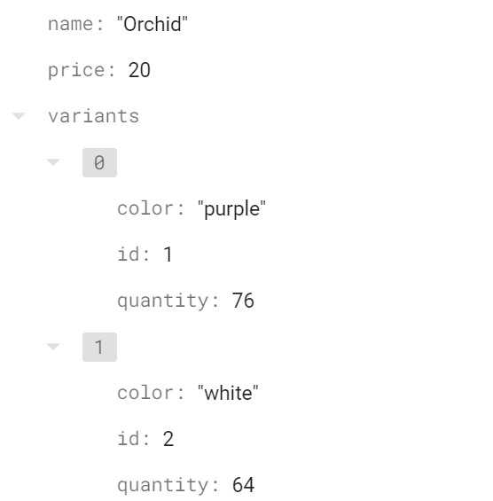
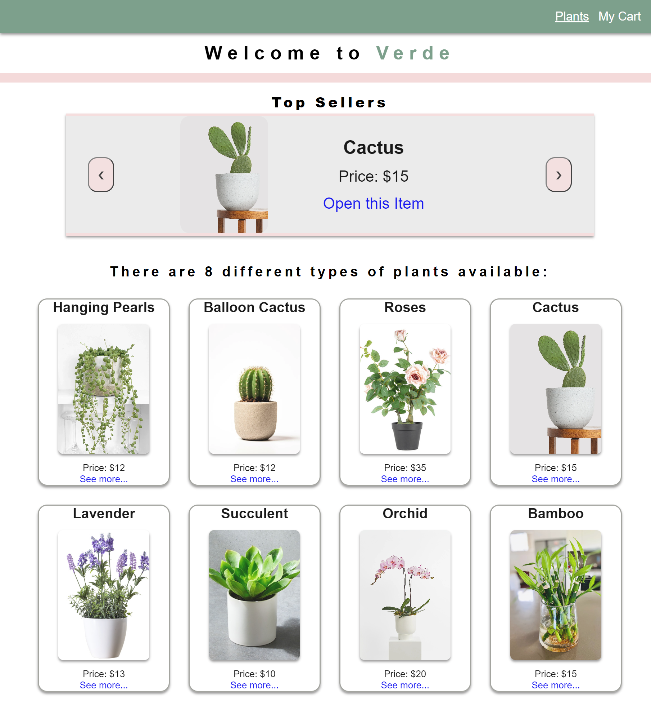
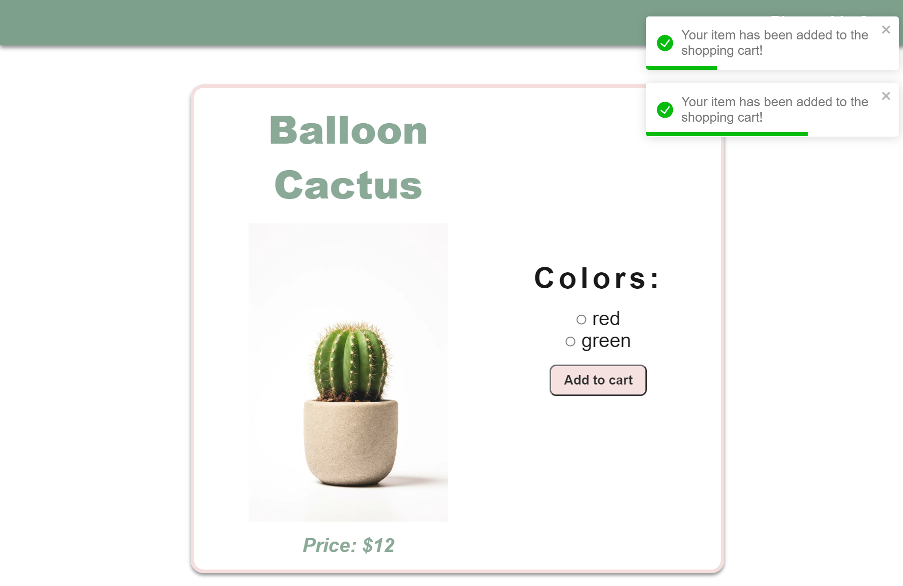
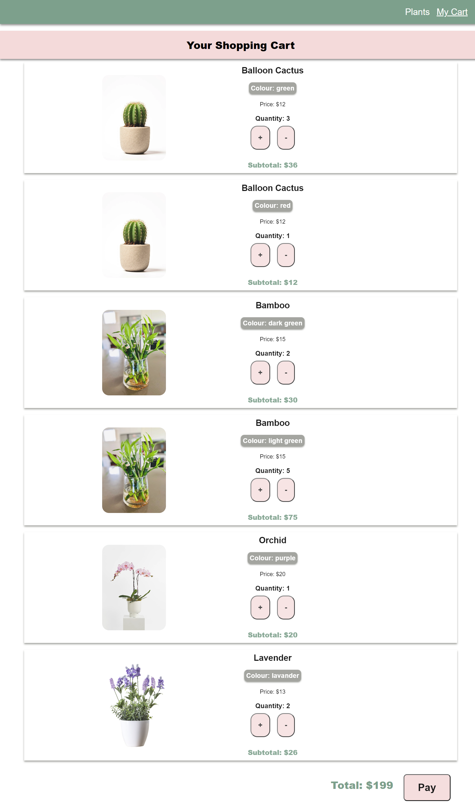
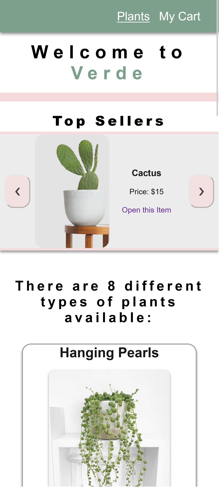

# VERDE - E-Commerce

## **Table of Contents** 

  - [**Table of Contents**](#table-of-contents)
  - [**Description**](#description)
  - [**My experience**](#my-experience)
  - [**Usage**](#usage)
  - [**Technologies Used**](#technologies-used)
  - [**Preview**](#preview)
  - [**Deployed link**](#deployed-link)
  - [**Future Development**](#future-development)
  - [**Questions**](#questions)


## **Description**

This project was designed to create an E-commerce platform that allows the user to purchase items. 

This interface allows the user to purchase diverse plants.
 - By accessing the application the Home Page displays a Carousel with the favourited/top seller plants. Also a list with each plant is displayed with the name, price and a link to "See more" information about this item.
 - When the user clicks the "See more" link, the application shows a new page with the plant's photo and its variants of colours and prices.
 - The user can click the "Add to Cart" button to add the plant to the shopping cart. A toast message is displayed on the top-right of the screen saying "The item has been added to the shopping cart".
 - If a plant is out of stock the user can not click the colour radio button or the "Add to cart" buttton.
  - If the user wants to see the shopping cart they can use the navigation bar to visit the shopping cart page which will display each item that was previously added. The shopping cart shows each plant's variant as an individual item.
- The user can increment each item quantity by clicking the " + " button, or decrement it with the " - " button. They can also delete this item from the shopping cart when decreasing the quantity until it reaches zero.
- A subtotal of each shopping cart item and the total of all the items are displayed on screen of the shopping cart. 
- The user can click the "Pay" button to proceed with the transaction and is presented with a "Thank you for your purchase" message and also a link to "Return home".
- When the shopping cart transaccion is completed the quantity of the items bought are decreased in Firestore.
   

## **My experience**

Creating the colour and quantity variants of each plant's item was a little bit challenging because of the data design I decided to implement. I used an array of variants within each plant's collection and each variant was an object containing id, colour name and quantity.



 Using the Context Provider and Props I could get access to each variant when the children needed access to use or modify the state variables. To render the shopping card I needed to use different Array iterators to give me access to the plant's stock quantity and the shopping cart quantity.

I found this project a great source of learning and practice of React theory and the implementation of UseState, UseEffect, Context Provider and NoSQL Firestore database.

For this project I chose a white background and pastel colours that can make the user/buyer feel relaxed and not overwhelmed during the shopping experience. 
[Colour palette here](https://colorhunt.co/palette/ffe1e190a17d829460eeeeee)

## **Usage**
```
npm run dev
```

## **Technologies Used**

* HTML
* Sass/Scss
* CSS
* JavaScript
* React
* Firestore
* Vite Testing

## **Preview**

* **Home - Desktop Mode**




* **Item Page - Desktop Mode**




* **Shopping Cart - Desktop Mode**




* **Mobile Mode**



## **Deployed link**

💡 Live version: [To be deployed - click here!]()

## **Future Development**

* Colour each variant's radio button with the corresponding plant colour.
* Description for each plant.
* Create a modal to display information when the user wants to delete an item from the shopping cart.

## **Questions**

* Contact me on my GitHub profile: [Marcela's GitHub](https://github.com/marcelamejiao)